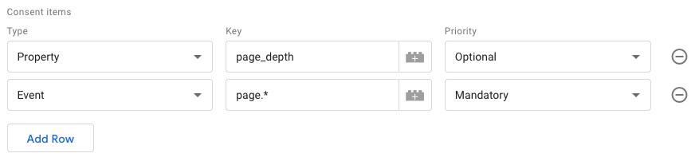
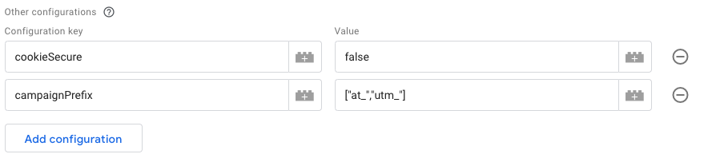
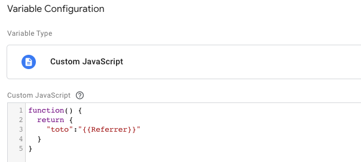
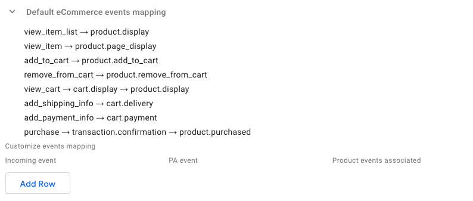
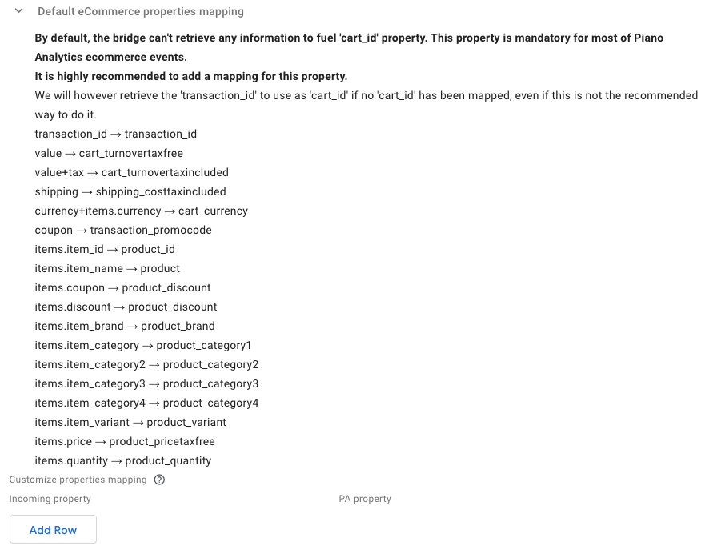
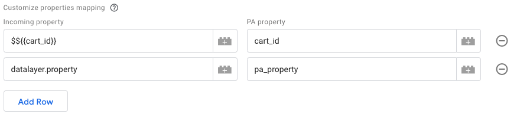
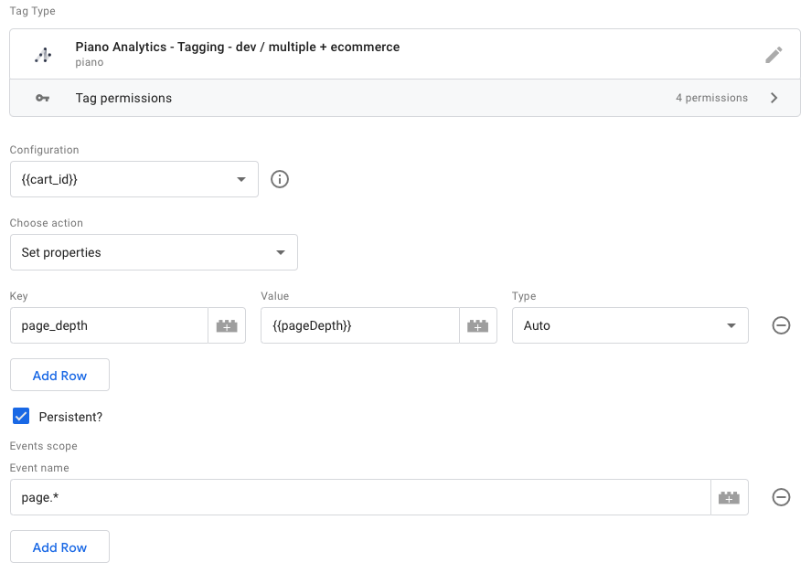
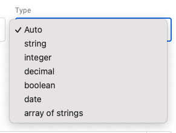
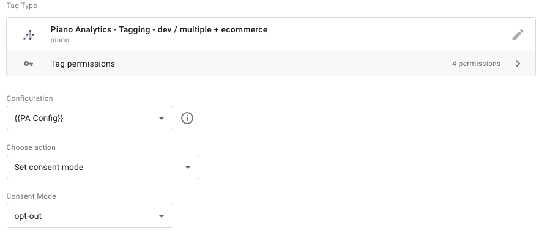
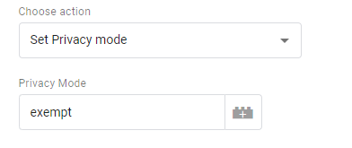

# Piano Analytics GTM template for tagging

> This template is meant to be used in combination with [Piano Analytics configuration template](https://github.com/at-internet/gtm-pa-configuration).

## Installation

Add both templates from the Gallery to your Workspace.

## Setup

### Variable (configuration)

Create a new *Variable* based on the *Piano Analytics - Configuration* template.

Fill your collection endpoint, site number, [PA SDK source](https://developers.atinternet-solutions.com/piano-analytics/data-collection/sdks/javascript#load-the-library) (up to date CDN file by default) and choose the default consent mode.

You can configure your Consent settings ([documentation](https://developers.atinternet-solutions.com/piano-analytics/data-collection/how-to-send-events/consent#manage-default-consent-modes)).

You can also add any other configuration available with our JS SDK ([documentation](https://developers.atinternet-solutions.com/piano-analytics/data-collection/sdks/javascript#configuration)).

### Tag

Create a new *Tag* based on the *Piano Analytics - Tagging* template.

Make sure you use the previously created Variable as the Configuration for the Tag.

You can now choose the action you need this tag to achieve.

#### Send an event

[Documentation](https://developers.atinternet-solutions.com/piano-analytics/data-collection/how-to-send-events/send-events-via-sdks)

Fill the *Event name* and all the properties needed.

#### Send multiple events

[Documentation](https://developers.atinternet-solutions.com/piano-analytics/data-collection/how-to-send-events/send-events-via-sdks)

For each event to be sent, fill the *Event name* and give a variable with an object of properties to be sent.

The event properties object can either be a JS Variable, or a custom JS Variable.

#### eCommerce bridge

[Documentation](https://developers.atinternet-solutions.com/piano-analytics/data-collection/how-to-send-events/sales-insights)

The template offers a native GA eCommerce bridge, that will automatically transform GA eCommerce tagging to Piano Analytics events and properties.

##### Events mapping

Default events mapping is displayed directly in the tag configuration.

##### Properties mapping

Default properties mapping is displayed directly in the tag configuration.

You can customize the properties mapping by adding new lines. Each line describes one mapping.

1. The first field expects the Datalayer property name. You can prefix the value with `$$` to give a value instead of a property name.
2. The second field expects the Piano Analytics property to fill with the output.

#### Set properties

[Documentation](https://developers.atinternet-solutions.com/piano-analytics/data-collection/how-to-send-events/send-events-via-sdks#add-properties-to-events)

You can set properties to subsequent events.

You can set the type of the property to either a fixed type, or to let the template automatically detect the type (using `JSON.parse` JS method).

#### Set a user

[Documentation](https://developers.atinternet-solutions.com/piano-analytics/data-collection/how-to-send-events/users)

You can user this action to identify a logged in user.

#### Set a Consent mode

[Documentation](https://developers.atinternet-solutions.com/piano-analytics/data-collection/how-to-send-events/consent#set-a-consent-mode)

You can set a new Consent mode if the end-user changes its preferences.

#### Set a Privacy mode (deprecated)

[Documentation](https://developers.atinternet-solutions.com/piano-analytics/data-collection/how-to-send-events/privacy#set-a-privacy-mode)

You can set a new Privacy mode if the end-user changes its preferences.

#### Override the Visitor ID (not recommended)

[Documentation](https://developers.atinternet-solutions.com/piano-analytics/data-collection/how-to-send-events/visitor-identification#visitor-identification-management)

You can override our SDK management of the Visitor ID. This is however not recommended.

