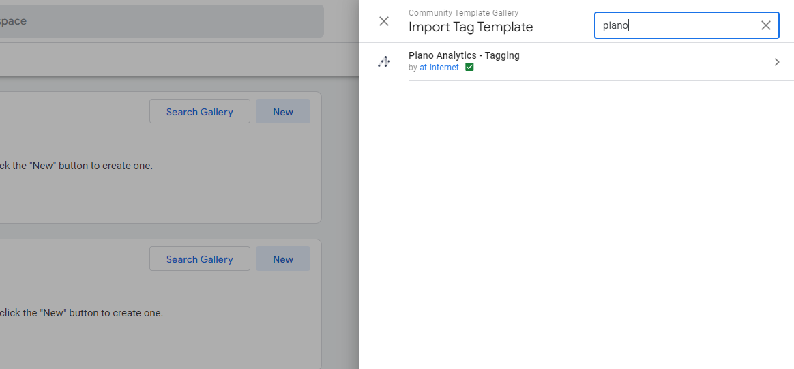
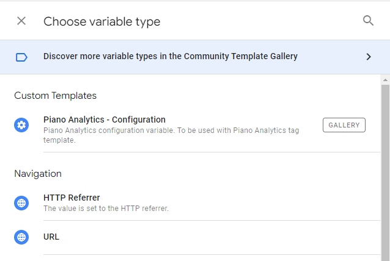
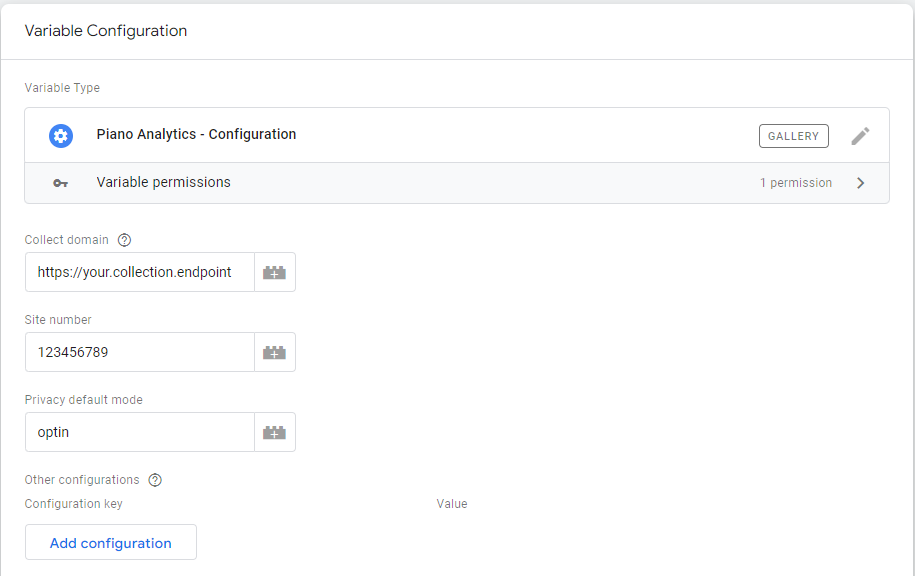
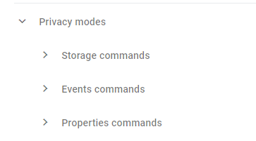
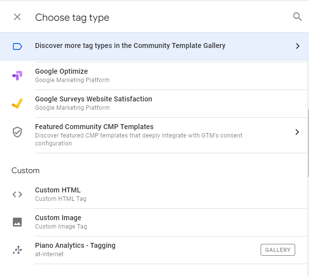
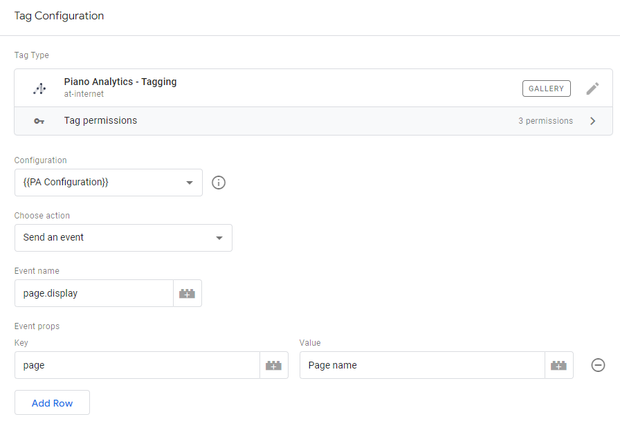
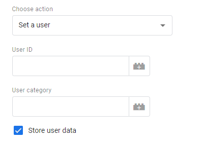
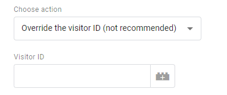

# Piano Analytics GTM template for tagging

> This template is meant to be used in combination with [Piano Analytics configuration template](https://github.com/at-internet/gtm-pa-configuration).

## Installation

Add both templates from the Gallery to your Workspace.

## Setup

### Variable (configuration)

Create a new *Variable* based on the *Piano Analytics - Configuration* template.

Fill your collection endpoint and site number. You can also add any other configuration available with our JS SDK ([documentation](https://developers.atinternet-solutions.com/piano-analytics/data-collection/sdks/javascript#configuration)).

Also, choose the default privacy mode.

Finally, you can configure your Privacy settings ([documentation](https://developers.atinternet-solutions.com/piano-analytics/data-collection/how-to-send-events/privacy#manage-a-privacy-mode)).

### Tag

Create a new *Tag* based on the *Piano Analytics - Tagging* template.

Make sure you use the previously created Variable as the Configuration for the Tag.

You can now choose the action you need this tag to achieve.

#### Send an event

[Documentation](https://developers.atinternet-solutions.com/piano-analytics/data-collection/how-to-send-events/send-events-via-sdks)

Fill the *Event name* and all the properties needed.

#### Set a user

[Documentation](https://developers.atinternet-solutions.com/piano-analytics/data-collection/how-to-send-events/users)

You can user this action to identify a logged in user.

#### Override the Visitor ID (not recommended)

[Documentation](https://developers.atinternet-solutions.com/piano-analytics/data-collection/how-to-send-events/visitor-identification#visitor-identification-management)

You can override our SDK management of the Visitor ID. This is however not recommended.

